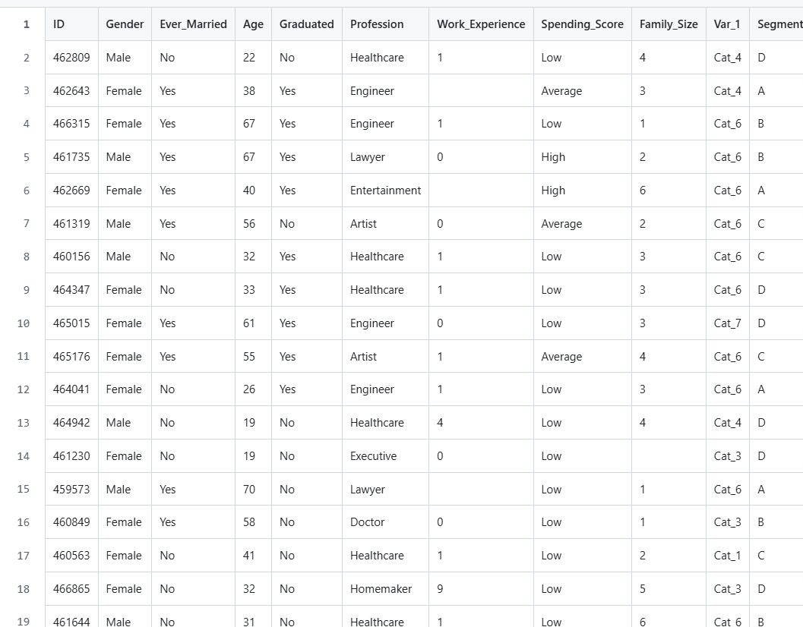
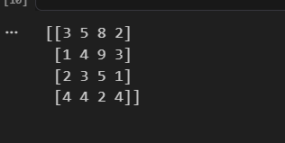
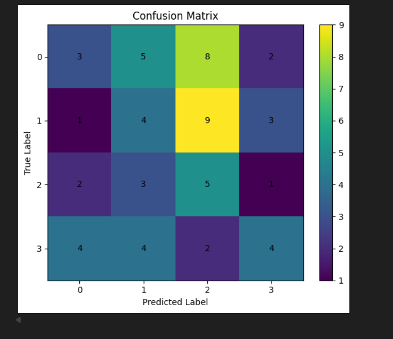
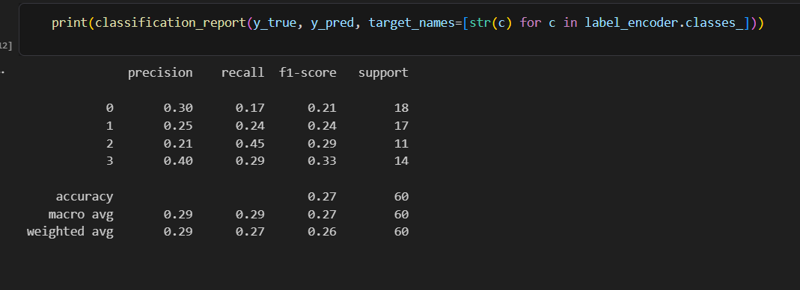
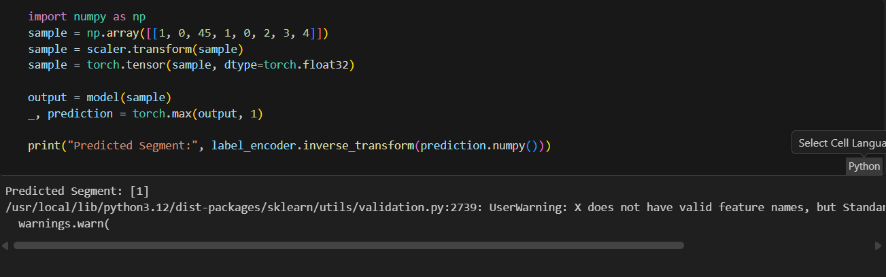

# Developing a Neural Network Classification Model

## AIM

To develop a neural network classification model for the given dataset.

## Problem Statement

An automobile company has plans to enter new markets with their existing products. After intensive market research, they’ve decided that the behavior of the new market is similar to their existing market.

In their existing market, the sales team has classified all customers into 4 segments (A, B, C, D ). Then, they performed segmented outreach and communication for a different segment of customers. This strategy has work exceptionally well for them. They plan to use the same strategy for the new markets.

You are required to help the manager to predict the right group of the new customers.

## Neural Network Model

Include the neural network model diagram.

## DESIGN STEPS

### STEP 1:
Write your own steps

### STEP 2:

### STEP 3:


## PROGRAM

# Define Neural Network(Model1)
```
class PeopleClassifier(nn.Module):
    def __init__(self, input_size):
        super(PeopleClassifier, self).__init__()
        self.fc1 = nn.Linear(input_size, 32)
        self.fc2 = nn.Linear(32, 16)
        self.fc3 = nn.Linear(16, 8)
        self.fc4 = nn.Linear(8, 4)
    def forward(self, x):
        x = F.relu(self.fc1(x))
        x = F.relu(self.fc2(x))
        x = F.relu(self.fc3(x))
        x = self.fc4(x)
        return x
```        
# Initialize the Model, Loss Function, and Optimizer
```
model = PeopleClassifier(input_size=X_train.shape[1])
criterion = nn.CrossEntropyLoss()
optimizer = optim.Adam(model.parameters(),lr=0.001)
train_model(model, train_loader, criterion, optimizer, epochs=100)

```
# function to train the model

```

def train_model(model, train_loader, criterion, optimizer, epochs):
    model.train()
    for epoch in range(epochs):
        for inputs, labels in train_loader:
          optimizer.zero_grad()
          outputs=model(inputs)
          loss=criterion(outputs, labels)
          loss.backward()
          optimizer.step()
    if (epoch + 1) % 10 == 0:
        print(f'Epoch [{epoch+1}/{epochs}], Loss: {loss.item():.4f}')
```        

### Name: SANTHOSH KUMAR A
### Register Number: 212224230250


## Dataset Information


## OUTPUT


### Confusion Matrix





### Classification Report



### New Sample Data Prediction



## RESULT

Thus neural network classification model is developded for the given dataset.

